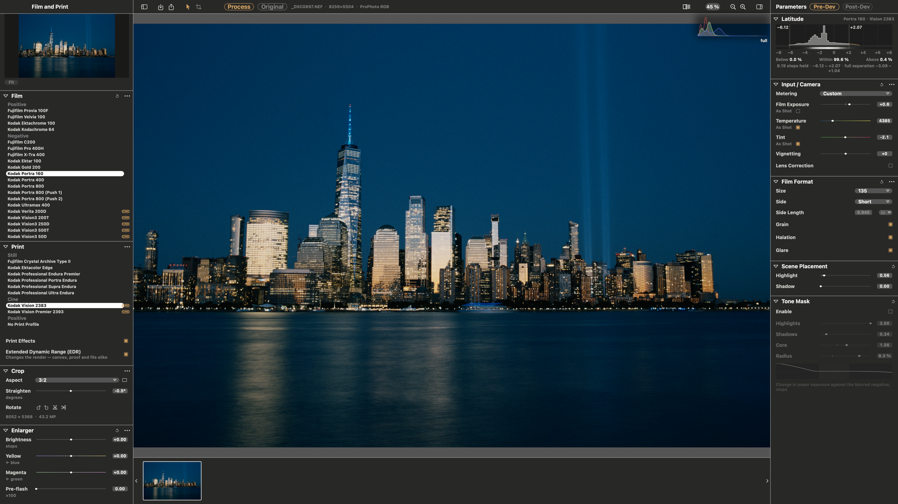

# SpektraLab

**English** · [简体中文](README.zh-CN.md)

A film and print simulator for macOS. Open a RAW, pick a film and a paper,
and get a physically modelled print — grain, halation, couplers, the enlarger's
filter pack — in about a second.



- **Spectral, not a LUT.** Light is traced through 81 wavelengths, the film's
  dye layers and the paper's, the way a darkroom does it.
- **Physical units.** Tell it the negative is 120 or 35 mm and the grain,
  halation and coupler diffusion scale with the frame in micrometres.
- **Fast.** A C++ Metal engine compiled into the app: a 45 MP reprint in
  ~0.01 s at preview size, a full-resolution render in under a second.
- **One colour pipeline.** ProPhoto RGB throughout; each export is gamut-mapped
  once into the space you ask for, and proofed before it is written.
- **Scriptable.** `spektralab` (CLI) and an MCP server drive the same session
  the window does. Off until enabled in Settings.

| RAW decode ⟷ film and paper (⌥\\) | grain at 1:1 |
|---|---|
|  |  |

## Install

Download the latest build from
[Releases](https://github.com/JamesQiu2005/SpektraLab/releases). It is
ad-hoc signed, so clear the quarantine once:

```bash
xattr -d -r com.apple.quarantine /Applications/SpektraLab.app
```

Apple silicon, macOS 15 or later.

## Build

Xcode 26.6.

```bash
engine/build.sh bundle                 # engine, kernels, baked resources
cd modern_UI/Spektrafilm
xcodebuild -project Spektrafilm.xcodeproj -scheme Spektrafilm \
           -derivedDataPath build/DerivedData build
```

Re-run `engine/build.sh bundle` whenever `engine/resources/` changes. If Xcode
suddenly cannot find `metal`, clean the build folder (⇧⌘K): the Metal
toolchain's mount path changed under a cached build.

## Test

```bash
xcodebuild -project Spektrafilm.xcodeproj -scheme SpektrafilmTests \
           -derivedDataPath build/DerivedData test       # ~430 tests, ~7 min
```

Camera fixtures come from the upstream `spektrafilm` repository through a
`tests` symlink (`ln -s ../spektrafilm/tests tests`). Without it 25 cases skip
and the run still reports 0 failures in ~20 s — trust the duration.

## Layout

| | |
|---|---|
| `modern_UI/Spektrafilm/` | the app: SwiftUI, AppKit, Metal |
| `engine/` | the C++20 render engine, its MSL kernels and C ABI |
| `engine/resources/` | baked constants, 28 film and paper profiles, print LUTs |
| `rfc/` | design records |
| `ARCHITECTURE.md` | how it fits together — start here |
| `AGENTS.md` | conventions and the traps that cost real time |

## Credits and licence

The film process model, its 28 measured profiles and the print LUTs are
[spektrafilm](https://github.com/andreavolpato/spektrafilm) by Andrea Volpato;
SpektraLab is a native C++/Metal port of that engine and the application built
around it.

| | |
|---|---|
| app and engine | GPL-3.0-or-later |
| film and paper profiles, print LUTs | CC BY-SA 4.0 |
| metal-cpp | Apache-2.0 |

All texts ship inside the app, under **SpektraLab → About SpektraLab**.
