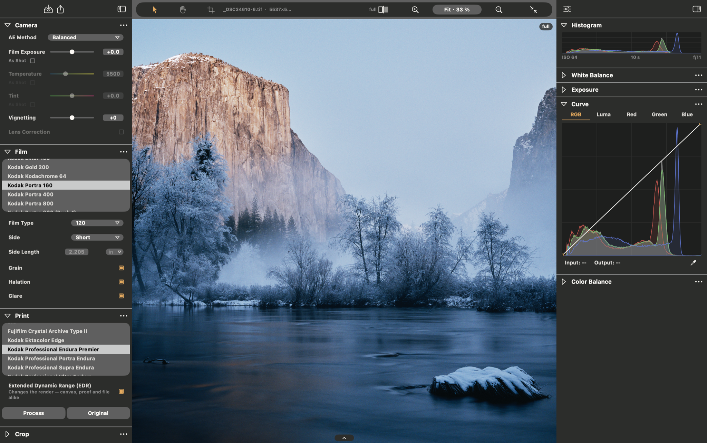
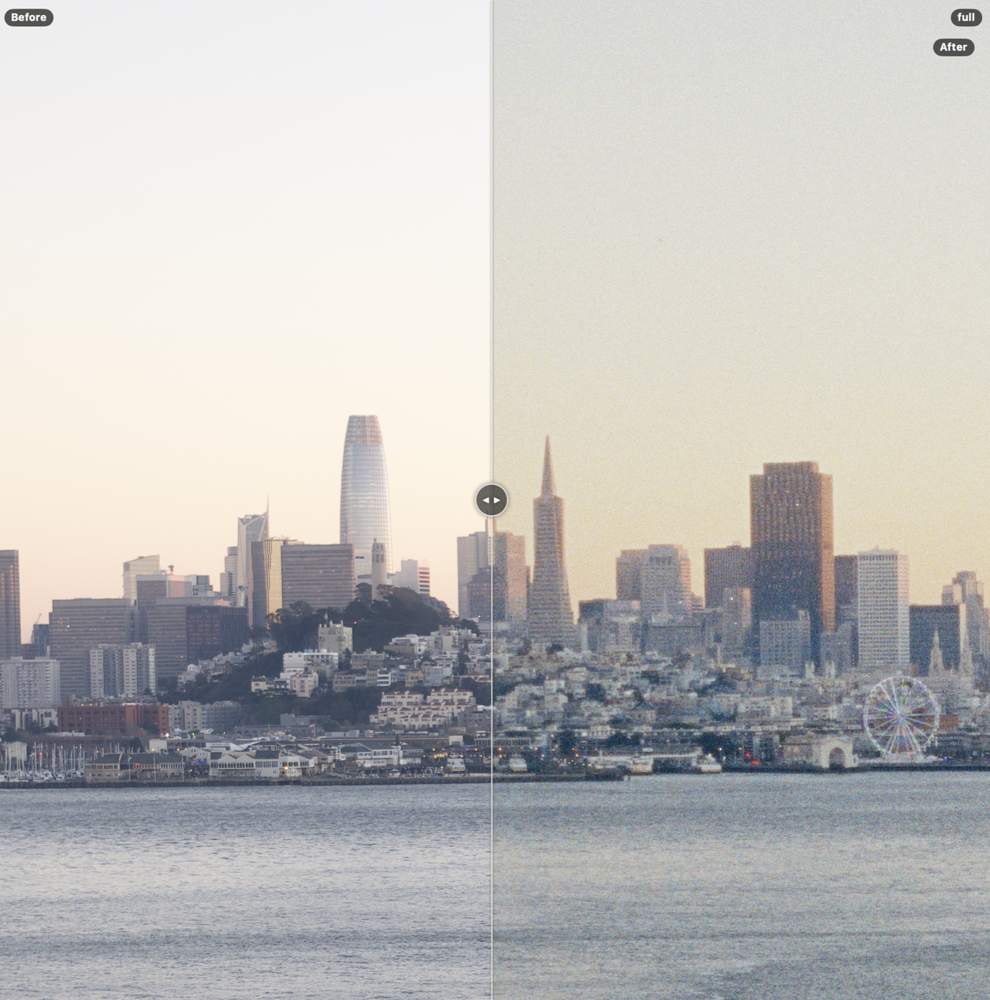
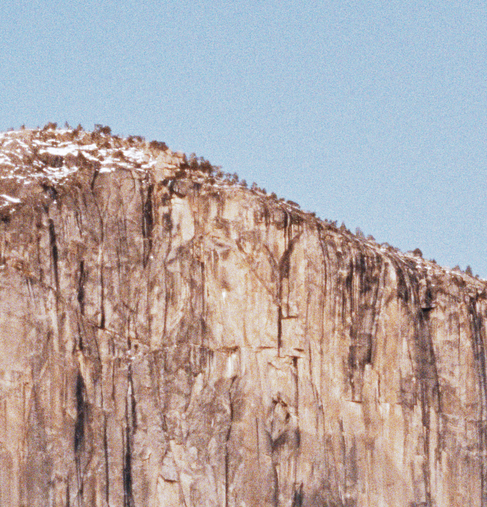

# SpektraLab

A macOS film and print simulator. Open a RAW or TIFF negative, choose a film
stock and a paper, and watch a physically-modelled render settle in under a
second — grain, halation, couplers, enlarger dichroics and all.

**SpektraLab is the application.** The simulation it runs is **spektrafilm** —
the engine, the 28 measured film profiles and the print-preview LUTs baked
from them are Andrea Volpato's, licensed CC BY-SA 4.0. This repository is the
desktop product built on top of that engine. See [Licensing](#licensing).

## What it looks like



**The two rails are the two halves of the program.** On the left is the
negative — camera, film stock, the physical frame, paper, crop — and most of it
is the engine: a change there is a render. On the right is the grade —
histogram, white balance, exposure, curve, colour balance — and that rail is
Layer 2, one Metal compute pass inside the app: a change there is a draw,
before the next frame. Which side a control is on is a statement about what
moving it costs, and `ARCHITECTURE.md` §7 has the row-by-row version —
including the four rows on the left that are neither.

**`Film Type · Side · Side Length` is not metadata.** 120, short side, 2.205 in:
the app turns that and the photograph's own aspect into one number — the
frame's long edge in millimetres — and the engine divides its micrometre
quantities by it. Grain is a particle count per sub-layer and channel derived
from the pixel pitch; halation and coupler diffusion are measured in µm. Tell
it the negative is 35 mm and the same photograph gets coarser grain, correctly.

**`full` is not a zoom level.** That badge says the canvas is showing this frame
at its own resolution rather than the preview, and it is up at a 33 % fit: the
canvas settles at native size after every edit, at whatever zoom. There is no
tier ladder to climb (§7.3).

| the split: decode against render (⌥\\) | the same engine, at 1:1 |
|---|---|
|  |  |

Left of the line is **Apple's decode of the RAW**, at the frame's own
resolution — never the engine's input — and right of it is the same photograph
through film and paper: halation where the bright sky meets the skyline, the
paper's contrast, grain. The line is anchored to the picture and not to the
window, so it stays on the same building while you pan and zoom.

The 1:1 crop is that grain, unresampled. At and above 100 % the canvas samples
nearest, so what is on screen is the render's own pixels rather than a smear of
them — which is the only way a grain model can be looked at honestly.
`screenshots/README.md` says where each capture comes from and how to re-take
it.

## How it is put together

```
┌─ SpektraLab.app ──────────────────────────────────────────────────────┐
│  SwiftUI + Metal, macOS                                               │
│                                                                       │
│  Session ── Renderer ── EngineClient                                  │
│                              │  spk_engine.h, a hand-written C ABI     │
│                              ▼                                        │
│  ┌─ engine/ ── C++20, compiled into this target ───────────────────┐  │
│  │  core/      setup maths: colour, profiles, curves, CAM16        │  │
│  │  gpu/       a five-verb interface + its Metal backend           │  │
│  │  shaders/   the kernels, MSL, in spektrafilm.metallib           │  │
│  │  pipeline/   the 21-node graph, the session, the C ABI          │  │
│  └─────────────────────────────────────────────────────────────────┘  │
│  Resources/engine/  baked constants, 28 profiles, the metallib        │
└───────────────────────────────────────────────────────────────────────┘
```

**One binary. No Python, no subprocess, no virtualenv at run time.** The engine
is statically compiled into the app and takes pixels in, handing back an
`MTLTexture` the canvas draws — zero copy, no file handoff. A 45 MP frame opens
in about a second.

**One working space, one conversion per destination.** The engine renders to
ProPhoto RGB; the grade, the masks and the curves all act there; the canvas is
tagged ProPhoto RGB and ColorSync converts it for the display; an export is
gamut-mapped into the space the recipe asks for and written in it. The export
page shows that file at its own resolution before you write it —
measured identical to the file, pixel for pixel. `ARCHITECTURE.md` §7.5 is the
chain; `rfc/RFC-018` is why.

---

## Build

Requires macOS 15+, Xcode 26.6 and an Apple-silicon Mac. `ARCHS = arm64` only.

```bash
engine/build.sh bundle     # compile the engine + kernels, rsync baked resources into the app
cd modern_UI/Spektrafilm
xcodebuild -project Spektrafilm.xcodeproj -scheme Spektrafilm \
           -derivedDataPath build/DerivedData build     # → SpektraLab.app
```

`engine/build.sh bundle` is **not optional and not automatic**: the app target
has a pre-build phase (`Tools/check-bundle-resources.sh`) that fails the build
when the resources are absent. The dangerous case is *stale*, not absent — re-run
`engine/build.sh bundle` after anything under `engine/resources/` changes.

### When Xcode cannot find `metal`

A build that was working stops with one of these, in Xcode or in `xcodebuild`,
and nothing in the repository has changed:

```
error: unable to spawn process '…/MetalToolchain-v27.1.266.1.Czoz89/…/metal' (Permission denied)
error: unable to spawn process '…/Metal.xctoolchain/usr/bin/metal' (No such file or directory)
error: cannot execute tool 'metal' due to missing Metal Toolchain
```

**Clean the build folder** (⇧⌘K in Xcode, or `rm -rf build/DerivedData`) and
build again. That is the whole fix.

Why: from Xcode 26 the Metal toolchain is not inside `Xcode.app`. It is a
downloadable component mounted as a cryptex under
`/var/run/com.apple.security.cryptexd/mnt/`, and the mount directory carries a
**random suffix that changes when it is remounted** — an OS update, a
reprovision, sometimes a reboot. Xcode's incremental build description caches
the compiler's *absolute path*, so after a remount that cached path points at a
directory that is gone, or at a leftover empty mount that is `drwx------ root`
and cannot be read. Nothing in the project is wrong and no source file is at
fault, which is what makes it read as "the last commit broke the build".

Two things that look like fixes and are not:

- `xcodebuild -downloadComponent MetalToolchain` re-downloads an asset that is
  already installed and leaves the stale mount in place.
- Symlinking the cryptex into `~/Library/Developer/Toolchains/` registers the
  same toolchain twice; `xcrun -sdk macosx metal` then refuses with *cannot
  execute tool 'metal' due to missing Metal Toolchain*, which breaks
  `engine/build.sh` while leaving Xcode working. Check for a stray
  `Metal.xctoolchain` there before believing the toolchain is missing.

Launch it, or use the snapshot harness:

```bash
build/DerivedData/Build/Products/Debug/SpektraLab.app/Contents/MacOS/SpektraLab \
    --snapshot 1200x700 /tmp/out.png --open frame.tif --wait 40
```

### Test

```bash
xcodebuild -project Spektrafilm.xcodeproj -scheme SpektrafilmTests \
           -derivedDataPath build/DerivedData test      # 277 tests, ~390 s with fixtures
engine/tests/check_math_guard.sh                        # the fast-math guard can fire
engine/build/gpu_smoke engine/resources/spektrafilm.metallib
```

Two schemes: `SpektrafilmFrontend` runs everything except the class that renders
a real negative (~7 s, no pixels); `SpektrafilmTests` is the full suite.
`SpektrafilmTests` is the target's name and has nothing to do with the product
name — see [Naming](#naming).

**Read the duration, not the failure count.** 25 tests need camera fixtures
under `tests/Test_image/`, which are multi-GB and deliberately not carried —
and a run without them reports **`0 failures` just the same**, in ~18 s instead
of ~390. Among the 25 are the cases that carry RFC-018 §7.2 and §7.6, so a
green short run is the one result worth distrusting. See `AGENTS.md` trap 26.

The fixtures live in the upstream `spektrafilm` fork. Each checkout reaches
them through a `tests` symlink at its own root, and **the correct target is
different in each**, which is why it is gitignored rather than committed:

```bash
ln -s ../spektrafilm/tests tests    # in this checkout
ln -s ../filmify/tests tests        # in a git worktree of it
ls tests/Test_image/A7m3            # should list the ARWs
```

Dropping a `_smoke_1mp.tif` there (a 1 MP linear ProPhoto TIFF) is enough for
the smaller cases; the RFC-018 measurements want the A7 III pair.

---

## What is in here, and what is deliberately not

| | |
|---|---|
| `modern_UI/Spektrafilm/` | the app: Swift sources, tests, `Tools/`, the Xcode project |
| `modern_UI/design/`, `reference_layout/`, `film_covers/` | the drawing the UI was measured against (`reference_layout/Main/`, 2026-09-17), its token derivation (`design/TOKENS-main-2026-09-17.md`), the layout captures, and the stock cover art |
| `engine/` | the C++ engine, its MSL kernels, its C ABI, its parity harnesses |
| `engine/resources/spektrafilm.metallib` | **not tracked, on purpose** — `engine/build.sh` recompiles it from `engine/src/shaders/*.metal` on every build, so it can never go stale against the shaders |
| `engine/resources/` | **tracked** — the baked constants, 28 profiles, the print-LUT index |
| `engine/third_party/metal-cpp/` | vendored Apple metal-cpp (Apache-2.0) |
| `screenshots/` | the product as it renders, on real frames — the pictures above, with their provenance |
| `rfc/`, `handoff/HANDOFF-*.md`, `ARCHITECTURE.md`, `AGENTS.md` | the design record and the traps |

Not here, on purpose: the **Python reference implementation**. Upstream
`spektrafilm` ships a numba/colour-science engine under `src/`; this repository
carries only the C++ port. The Python engine never shipped and never will — but
it is the oracle several harnesses compare against, so see below if you need it.

### Naming

The product is **SpektraLab**; the engine, profiles and LUTs are
**spektrafilm**. That split is deliberate and the licence asks for it:
`SPEKTRAFILM_LICENSE.txt` says not to use "spektrafilm" in product branding
without asking, while explicitly welcoming the factual reference. The About
panel says which is which.

Internally the Xcode **target**, the **scheme** and the Swift **module** are
still called `Spektrafilm`. Renaming those buys nothing a user can see and
breaks every `BlueprintName` in the schemes, so they stay. The product was
first renamed from Filmify to **SpektraLab** on 2026-09-16; the bundle id
(`com.hanze.filmify`) deliberately did not move with it — it is what macOS's
notarisation and Gatekeeper already have on record for this app, and changing
it is a separate, larger decision than renaming what the user sees. Only the
*product* name and the user-visible strings are SpektraLab.

### Rebaking the engine resources

`engine/resources/` is 15 MB of generated data that is **checked in**, because
regenerating it needs the whole Python reference package plus nine native
dependencies (scipy, matplotlib, exiv2, OpenImageIO, rawpy, lensfunpy,
scikit-image, opt-einsum, numpy). The engine itself needs none of them, and a
desktop checkout should not have to install a colour-science stack to build an
app. So the output travels and the generator is the tool of record:

```bash
# from a checkout that HAS the Python tree, e.g. the upstream fork:
PYTHONPATH=src .venv/bin/python engine/tools/bake_resources.py --out engine/resources
```

Re-bake only when a profile, LUT or colour constant changes, then commit the
result. `Tools/gen-catalog.py` reads the catalog straight out of
`engine/resources/`, so the app's stock list cannot disagree with what the
engine will actually load.

### Parity harnesses

`engine/tests/parity_*.py` drive the **shipping dylib** through `ctypes` and
compare it against the Python reference. They are the reason the C++ port can
be trusted, and they need that reference:

```bash
PYTHONPATH=<reference-checkout>/src .venv/bin/python engine/tests/parity_setup.py
```

Point `PYTHONPATH` at a checkout of the upstream fork, build the dylib first
(`engine/build.sh dylib`), and use the 1 MP frame — parity is a correctness
question, not a performance one. `parity_lut.py` additionally wants
`SPEKTRAFILM_REFERENCE_ROOT`: its baked `.npz` assets are looked up under the
reference tree, which this repository deliberately does not carry.

A harness asserts about the engine, so **anything it believes about the
engine's configuration it has to ask for**. `parity_render`, `parity_grain` and
`parity_exposure` read the session's resolved output colour space out of the
`open` reply; they used to hold their own copy of it and went red for a change
that moved no node. `parity_schema` carries one recorded `KNOWN` divergence —
`params.hpp` declares ProPhoto RGB and the Python oracle still declares sRGB —
which fails if the two ever agree again. See `AGENTS.md` trap 28.

---

## Licensing

| what | licence | file |
|---|---|---|
| SpektraLab, the app | GPL-3.0-or-later | `LICENSE` |
| the C++ render engine | GPL-3.0-or-later | `LICENSE` |
| film and paper profiles, and the print-preview LUTs derived from them | CC BY-SA 4.0 | `SPEKTRAFILM_LICENSE.txt` |
| vendored metal-cpp | Apache-2.0 | `engine/third_party/metal-cpp/LICENSE.txt` |

All four texts ship inside the `.app` (`Tools/bundle-licenses.sh`, checked by
`LicensingTests` and the pre-build phase) and are reachable from
**SpektraLab → About SpektraLab**. That panel is an obligation rather than polish:
CC BY-SA names "an app's About screen" by example as a place attribution must
survive, and the GPL wants a route to the corresponding source.

The profiles ship **unmodified**. The 8 print-preview LUTs are **derivatives**
— the licence says a LUT is "a direct encoding of the information in the
original profiles" — so they carry the same CC BY-SA 4.0. What was changed and
how is recorded in `Resources/Licenses/Profiles-and-LUTs-CHANGELOG.txt`.

---

## Status

Working and used daily. Real gaps, stated: there is no CI, no auto-update and
no crash reporting; the build is arm64-only; and shipping a notarised DMG still
needs a Developer ID certificate. `handoff/HANDOFF-DISTRIBUTION.md` is the full
checklist and `handoff/HANDOFF-OPEN-PATH.md` the current performance work.
