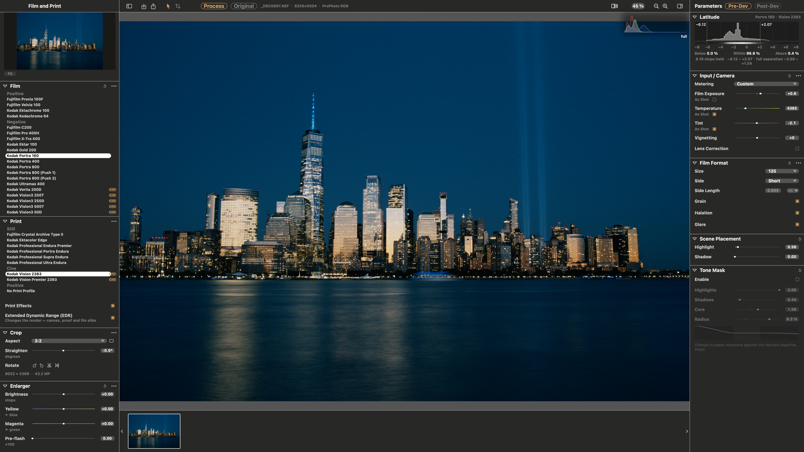

# SpektraLab

**English** · [简体中文](README.zh-CN.md)

A film and print simulator for macOS. Open a RAW, pick a film and a paper,
and get a physically modelled print — grain, halation, couplers, the enlarger's
filter pack — in about a second.



- **Spectral, not a LUT.** Light is traced through 81 wavelengths, the film's
  dye layers and the paper's, the way a darkroom does it.
- **Physical units.** Tell it the negative is 120 or 35 mm and the grain,
  halation and coupler diffusion scale with the frame in micrometres.
- **Fast.** A C++ Metal engine compiled into the app: a 45 MP reprint in
  ~0.01 s at preview size, a full-resolution render in under a second.
- **One colour pipeline.** ProPhoto RGB throughout; each export is gamut-mapped
  once into the space you ask for, and proofed before it is written.
- **The film itself.** Film Edge prints the frame on its own strip — rebate,
  perforations, each stock's edge print and frame numbers, measured on real
  strips — in 135, half frame, XPan, 645 to 6×9, 6×12 and 6×17. Date Back
  exposes a date onto the negative.
- **Half-frame pairs.** Two frames on one piece of film, side by side or one
  above the other, each with its own exposure, white balance, print and grade.
- **Scriptable.** `spektralab` (CLI) and an MCP server drive the same session
  the window does. Off until enabled in Settings.

| RAW decode ⟷ film and paper (⌥\\) | grain at 1:1 |
|---|---|
|  |  |

## Install

Download the latest build from
[Releases](https://github.com/JamesQiu2005/SpektraLab/releases). It is
ad-hoc signed, so clear the quarantine once:

```bash
xattr -d -r com.apple.quarantine /Applications/SpektraLab.app
```

Apple silicon, macOS 15 or later.

## Select and sync photos

Click a photo to make it the current photo, then Command-click other photos to
add or remove them without moving the current photo. Command+A (Edit → Select
All Photos) selects the library and keeps the current photo as the sync source.
In a newly opened folder it opens the first photo. Command+A inside a text field
still selects text.

Under Settings Clipboard, tick the groups to transfer and choose **Sync to N**
(or Edit → Sync Settings). This reads the current photo's latest edits, preserves
the clipboard and source photo, and saves the other selected photos immediately.
They develop with those settings when opened. Crop, Post-Dev adjustments, lens
correction, Film Edge and Date Back stay with each photo, following the existing
clipboard rules. As Shot white balance and fitted Scene Placement are resolved
for each target. Sync has no batch undo; the status reports writes and failures.
Selection and sync are disabled during batch export.

## Film Edge, Date Back and half-frame pairs

**Film Edge** (left rail) turns the canvas into the film: pick a format and the
frame is cut to its gate and shown on the strip, with the stock's own edge
print, a frame number you can set, and — on a strip scan — the carrier past the
film's edge. The crop becomes the framing in the gate, so it is part of the
negative. **Date Back** exposes the shooting date (or a date you type) into the
frame; it needs no film edge.

**A half-frame pair** is two frames on one frame's worth of 135. With Film Edge
on *Half*, **Enter Half-Frame Pair** appears under the format (or pick two
photos and press ⌘J). The canvas shows two holes; an empty one has a **+**.
Click a hole to pick its frame: Input / Camera, Scene Placement, the Enlarger
and Post-Dev then act on that frame alone, and *+ Film* moves the film around
it too. Right-click a hole to replace, turn or crop its frame. In the crop
mode, drag moves the picture under its hole and scroll or pinch scales it about
the pointer. A pair is one item in the filmstrip and exports as one picture.

Drag a thumbnail along the filmstrip to reorder a folder; the order is kept for
that folder. A file dropped from Finder still opens and edits.

## Build

Xcode 26.6.

```bash
engine/build.sh bundle                 # engine, kernels, baked resources
cd modern_UI/Spektrafilm
xcodebuild -project Spektrafilm.xcodeproj -scheme Spektrafilm \
           -derivedDataPath build/DerivedData build
```

Re-run `engine/build.sh bundle` whenever `engine/resources/` changes. If Xcode
suddenly cannot find `metal`, clean the build folder (⇧⌘K): the Metal
toolchain's mount path changed under a cached build.

## Test

```bash
xcodebuild -project Spektrafilm.xcodeproj -scheme SpektrafilmTests \
           -derivedDataPath build/DerivedData test       # ~550 tests, ~6 min
```

Camera fixtures come from the upstream `spektrafilm` repository through a
`tests` symlink (`ln -s ../spektrafilm/tests tests`). Without it 25 cases skip
and the run still reports 0 failures in ~20 s — trust the duration.

## Layout

| | |
|---|---|
| `modern_UI/Spektrafilm/` | the app: SwiftUI, AppKit, Metal |
| `engine/` | the C++20 render engine, its MSL kernels and C ABI |
| `engine/resources/` | baked constants, 28 film and paper profiles, print LUTs |
| `rfc/` | design records |
| `ARCHITECTURE.md` | how it fits together — start here |
| `AGENTS.md` | conventions and the traps that cost real time |

## Credits and licence

The film process model, its 28 measured profiles and the print LUTs are
[spektrafilm](https://github.com/andreavolpato/spektrafilm) by Andrea Volpato;
SpektraLab is a native C++/Metal port of that engine and the application built
around it.

| | |
|---|---|
| app and engine | GPL-3.0-or-later |
| film and paper profiles, print LUTs | CC BY-SA 4.0 |
| metal-cpp | Apache-2.0 |

All texts ship inside the app, under **SpektraLab → About SpektraLab**.
