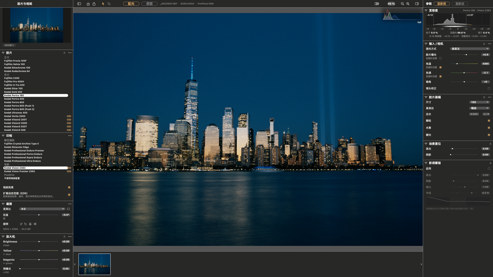

# SpektraLab

[English](README.md) · **简体中文**

macOS 上的胶片与放大相纸模拟器。打开一张 RAW，选好胶片和相纸，约一秒内得到一张按物理过程建模的照片——颗粒、光晕、成色剂耦合、放大机滤色，一样不少。



- **光谱计算，不是 LUT。** 光线以 81 个波长穿过胶片与相纸各自的染料层，和暗房里的过程一致。
- **物理尺度。** 告诉它底片是 120 还是 135，颗粒、光晕和成色剂扩散就按画幅以微米为单位缩放。
- **快。** C++ Metal 引擎直接编译进应用：4500 万像素在预览尺寸下重印约 0.01 秒，全分辨率渲染不到一秒。
- **一条色彩管线。** 全程 ProPhoto RGB；每次导出只做一次色域映射，映射到你指定的色彩空间，写入前可先软打样。
- **可脚本化。** `spektralab` 命令行与 MCP 服务器驱动的是与窗口同一个会话。默认关闭，在设置中开启。

| RAW 解码 ⟷ 胶片与相纸（⌥\\） | 1:1 颗粒 |
|---|---|
|  |  |

## 安装

从 [Releases](https://github.com/JamesQiu2005/SpektraLab/releases) 下载最新版本。应用为 ad-hoc 签名，首次运行前需解除隔离：

```bash
xattr -d -r com.apple.quarantine /Applications/SpektraLab.app
```

需要 Apple 芯片、macOS 15 或更高版本。

## 构建

Xcode 26.6。

```bash
engine/build.sh bundle                 # 引擎、着色器、预烘焙资源
cd modern_UI/Spektrafilm
xcodebuild -project Spektrafilm.xcodeproj -scheme Spektrafilm \
           -derivedDataPath build/DerivedData build
```

`engine/resources/` 有改动时请重新运行 `engine/build.sh bundle`。若 Xcode 突然找不到 `metal`，清理构建文件夹（⇧⌘K）即可：Metal 工具链的挂载路径变了，而旧构建缓存了原路径。

## 测试

```bash
xcodebuild -project Spektrafilm.xcodeproj -scheme SpektrafilmTests \
           -derivedDataPath build/DerivedData test       # 约 430 个用例，约 7 分钟
```

相机测试样片来自上游 `spektrafilm` 仓库，通过 `tests` 软链接接入（`ln -s ../spektrafilm/tests tests`）。缺少样片时有 25 个用例会被跳过，运行结果依然显示 0 失败，只需约 20 秒——请以耗时判断，而非失败数。

## 目录

| | |
|---|---|
| `modern_UI/Spektrafilm/` | 应用本体：SwiftUI、AppKit、Metal |
| `engine/` | C++20 渲染引擎、MSL 着色器与 C ABI |
| `engine/resources/` | 预烘焙常量、28 款胶片与相纸配置、放大 LUT |
| `rfc/` | 设计记录 |
| `ARCHITECTURE.md` | 整体结构——从这里开始读 |
| `AGENTS.md` | 约定，以及真正耗过时间的坑 |

## 致谢与许可

胶片过程模型、28 款实测配置与放大 LUT 来自 Andrea Volpato 的 [spektrafilm](https://github.com/andreavolpato/spektrafilm)；SpektraLab 是该引擎的原生 C++/Metal 移植，以及围绕它构建的应用。

| | |
|---|---|
| 应用与引擎 | GPL-3.0-or-later |
| 胶片与相纸配置、放大 LUT | CC BY-SA 4.0 |
| metal-cpp | Apache-2.0 |

全部许可文本随应用附带，见 **SpektraLab → 关于 SpektraLab**。
