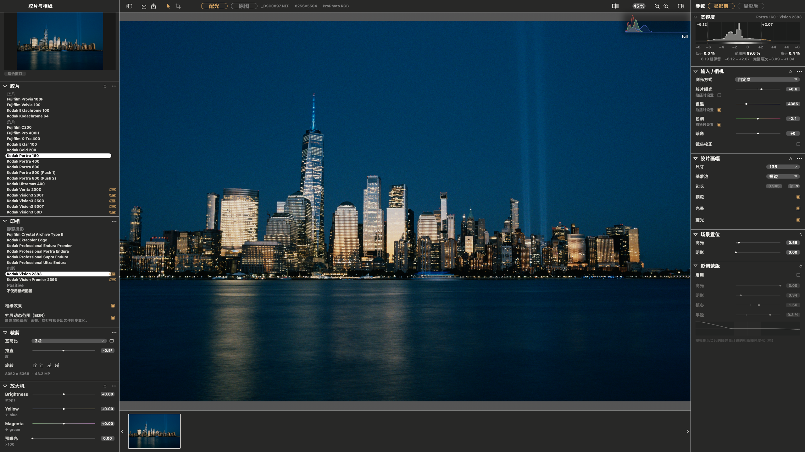
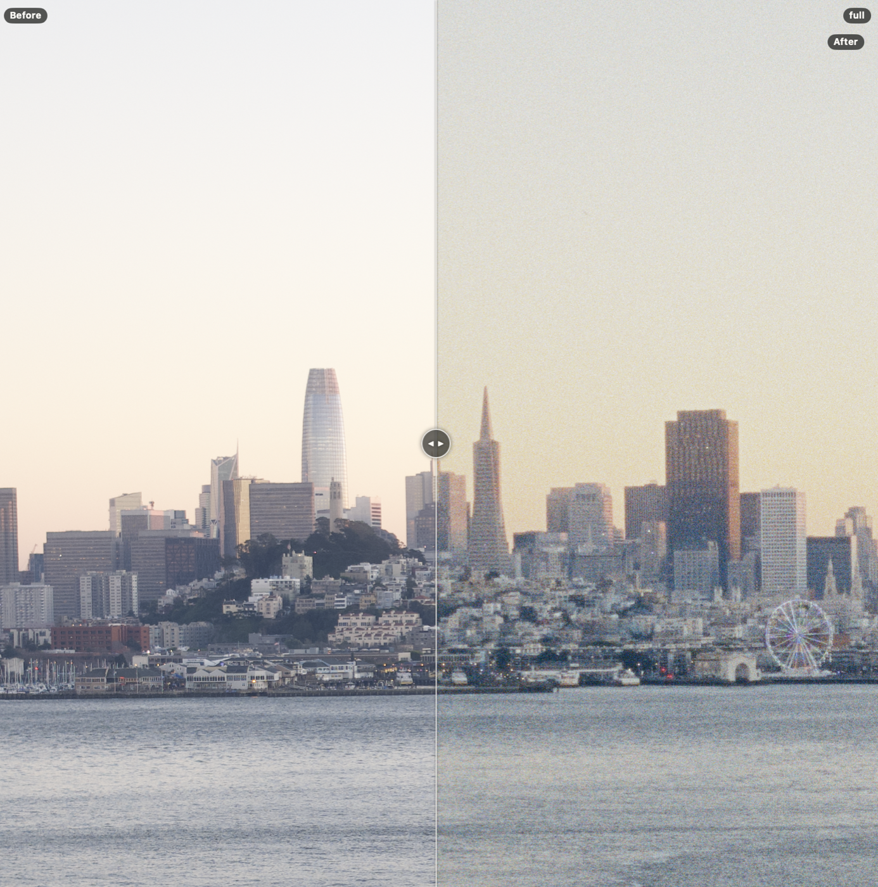
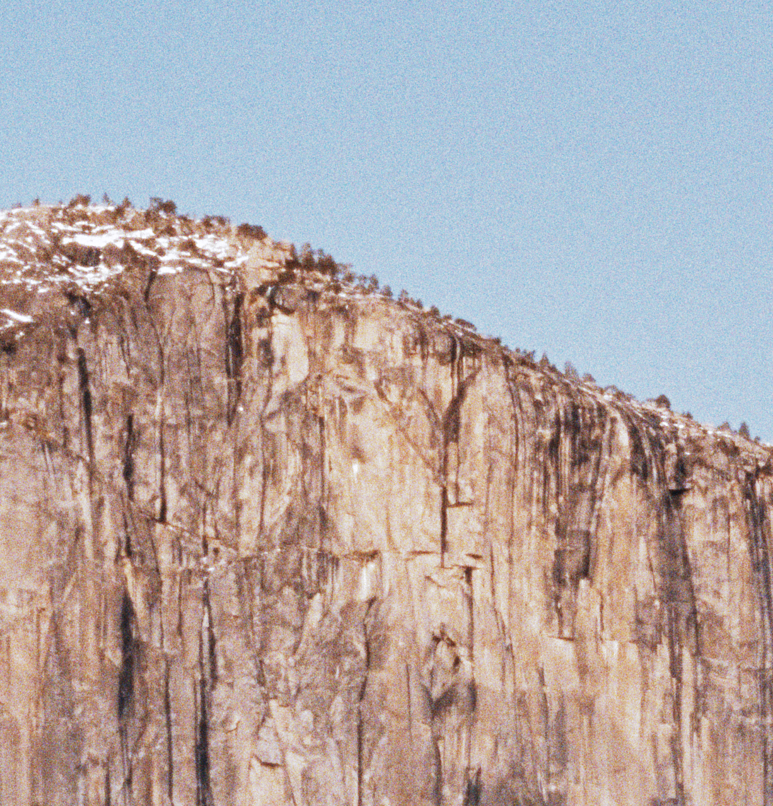

# SpektraLab

[English](README.md) · **简体中文**

**Windows 开发版：**本分支增加了 C++/Vulkan 后端、原生 LibRaw 解码、RGB16 TIFF 导出和 Windows 桌面界面。
构建方法见 [Windows 说明](engine/WINDOWS.md)，已验证功能及限制见 [功能覆盖表](engine/WINDOWS_FEATURE_COVERAGE.md)。
[Qt Quick 前端](windows_UI/README.md) 已开始复刻胶片与相纸编辑布局，同时保留[最小 Win32 窗口](engine/WINDOWS_DESKTOP.md)。
下文介绍的 macOS 产品还包含尚未完成 Windows 迁移的界面与显示功能。

macOS 上的胶片与放大相纸模拟器。打开一张 RAW，选好胶片和相纸，约一秒内得到一张按物理过程建模的照片——颗粒、光晕、成色剂耦合、放大机滤色，一样不少。



- **光谱计算，不是 LUT。** 光线以 81 个波长穿过胶片与相纸各自的染料层，和暗房里的过程一致。
- **物理尺度。** 告诉它底片是 120 还是 135，颗粒、光晕和成色剂扩散就按画幅以微米为单位缩放。
- **快。** C++ Metal 引擎直接编译进应用：4500 万像素在预览尺寸下重印约 0.01 秒，全分辨率渲染不到一秒。
- **一条色彩管线。** 全程 ProPhoto RGB；每次导出只做一次色域映射，映射到你指定的色彩空间，写入前可先软打样。
- **胶片本身。** “片边”把画面印在它自己的胶片上——片基、齿孔、各胶片自己的片边字与格号，均按真实胶片实测——支持 135、半格、XPan、645 至 6×9、6×12 与 6×17。“日期后背”把日期曝在底片上。
- **半格拼接。** 两张照片同在一段胶片上，左右或上下排列，各自有独立的曝光、白平衡、印相与调色。
- **可脚本化。** `spektralab` 命令行与 MCP 服务器驱动的是与窗口同一个会话。默认关闭，在设置中开启。

| RAW 解码 ⟷ 胶片与相纸（⌥\\） | 1:1 颗粒 |
|---|---|
|  |  |

## 安装

从 [Releases](https://github.com/JamesQiu2005/SpektraLab/releases) 下载最新版本。应用为 ad-hoc 签名，首次运行前需解除隔离：

```bash
xattr -d -r com.apple.quarantine /Applications/SpektraLab.app
```

需要 Apple 芯片、macOS 15 或更高版本。

## 多选与同步照片

单击照片将其设为当前照片，再按住 Command 单击其他照片即可增选或取消选择，
当前照片保持不变。Command+A（编辑 → 全选照片）选中图库中的全部照片，并保留
当前照片作为同步源；刚打开文件夹时则打开第一张。在文字输入框中，Command+A
仍然用于全选文字。

在“设置剪贴板”中勾选需要传递的项目，再点击 **同步到 N 张**（或编辑 → 同步设置）。
同步读取当前照片的最新编辑，不改变剪贴板和源照片，立即保存其他选中照片的设置，
并在打开它们时重新显影。沿用现有剪贴板规则，裁剪、显影后调整、镜头校正、
Film Edge 和 Date Back 不参与同步；拍摄时白平衡和场景放置拟合由目标照片自行解析。
同步没有批量撤销，状态栏会报告写入和失败数量。批量导出期间禁止修改选择和同步。

## 片边、日期后背与半格拼接

**片边**（左栏）让画布变成胶片：选定画幅后，画面按片门裁切并显示在片条上，带有该胶片自己的片边字和可设定的格号；条扫的画面止于胶片边缘。裁剪成为片门内的取景，因此属于底片的一部分。**日期后背**把拍摄日期（或自行输入的日期）曝进画面，无需开启片边；开启片边后可同时把拍摄数据印在画面旁，120（645 至 6×9）的日期与数据则印在画面旁的片边上，一如中画幅后背。

**半格拼接**是把两张照片放在一格 135 的胶片上。片边画幅选“半格”时，其下方出现 **进入半格拼接**（或选中两张照片后按 ⌘J）。画布显示两个片格，空格上有 **+**。点击片格即选中其中的照片：此时“输入 / 相机”、场景置位、放大机与显影后调整只作用于这一格，选“含片基”则连同周围的胶片一起变化。右键片格可替换、旋转或裁剪其中的照片。裁剪模式下，拖动移动画面，滚动或捏合以指针为中心缩放。一组拼接在胶片条中是一个项目，导出为一张图。

在胶片条上拖动缩略图即可调整文件夹内的顺序，顺序按文件夹保存。从访达拖入的文件仍然直接打开并编辑。

## 构建

Xcode 26.6。

```bash
engine/build.sh bundle                 # 引擎、着色器、预烘焙资源
cd modern_UI/Spektrafilm
xcodebuild -project Spektrafilm.xcodeproj -scheme Spektrafilm \
           -derivedDataPath build/DerivedData build
```

`engine/resources/` 有改动时请重新运行 `engine/build.sh bundle`。若 Xcode 突然找不到 `metal`，清理构建文件夹（⇧⌘K）即可：Metal 工具链的挂载路径变了，而旧构建缓存了原路径。

## 测试

```bash
xcodebuild -project Spektrafilm.xcodeproj -scheme SpektrafilmTests \
           -derivedDataPath build/DerivedData test       # 约 550 个用例，约 6 分钟
```

相机测试样片来自上游 `spektrafilm` 仓库，通过 `tests` 软链接接入（`ln -s ../spektrafilm/tests tests`）。缺少样片时有 25 个用例会被跳过，运行结果依然显示 0 失败，只需约 20 秒——请以耗时判断，而非失败数。

## 目录

| | |
|---|---|
| `modern_UI/Spektrafilm/` | 应用本体：SwiftUI、AppKit、Metal |
| `engine/` | C++20 渲染引擎、MSL 着色器与 C ABI |
| `engine/resources/` | 预烘焙常量、28 款胶片与相纸配置、放大 LUT |
| `rfc/` | 设计记录 |
| `ARCHITECTURE.md` | 整体结构——从这里开始读 |
| `AGENTS.md` | 约定，以及真正耗过时间的坑 |

## 致谢与许可

胶片过程模型、28 款实测配置与放大 LUT 来自 Andrea Volpato 的 [spektrafilm](https://github.com/andreavolpato/spektrafilm)；SpektraLab 是该引擎的原生 C++/Metal 移植，以及围绕它构建的应用。

| | |
|---|---|
| 应用与引擎 | GPL-3.0-or-later |
| 胶片与相纸配置、放大 LUT | CC BY-SA 4.0 |
| metal-cpp | Apache-2.0 |

全部许可文本随应用附带，见 **SpektraLab → 关于 SpektraLab**。
